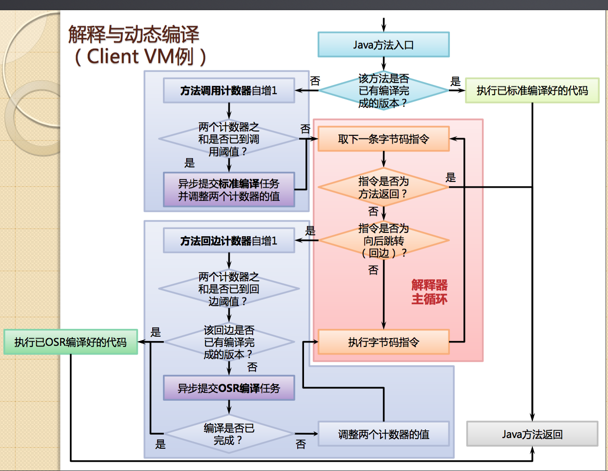

##JIT基础知识
---
### 对象布局与对象大小
---
- 对象布局：

- 对象大小：

```
  import java.util.HashMap;
/**
 * 64位开启指针压缩的话，markword变成8字节，压缩了class指针为4字节，故对象头12字节
 * 64位没有开启指针压缩的话，markword8字节，class指针8字节，对象头16字节
 * 32位markword为4字节，class指针为4字节，对象头8字节
 *
 * 另外，静态属性所占用的空间通常不算在对象本身，因为它的引用是在方法区。
 *
 */
public class ObjectSize {
    public static void main(String[] args){
        System.out.println(SizeOfTool.getObjectSize(new A(),SizeEnum.B));
        System.out.println(SizeOfTool.getObjectSize(new B(),SizeEnum.B));
        System.out.println(SizeOfTool.getObjectSize(new C(),SizeEnum.B));
        System.out.println(SizeOfTool.getObjectSize(new D(),SizeEnum.B));
        System.out.println(SizeOfTool.getObjectSize(new E(),SizeEnum.B));
        System.out.println(SizeOfTool.getObjectSize(new Q(),SizeEnum.B));
        /**
         * 64位压缩指针下，对象头12字节，数组长度描述4字节，数据4*100 =16+400 = 416
         */
        System.out.println(SizeOfTool.getObjectSize(new int[100],SizeEnum.B));
        /**
         * 属性4位对齐
         * 64位压缩指针下，对象头12字节，数组长度描述4字节，数据1*100，对齐后104 = 16+104 = 120
         */
        System.out.println(SizeOfTool.getObjectSize(new byte[100],SizeEnum.B));
        /**
         * 二维数组
         * 64位指针压缩下
         * 第1维数组，对象头12字节，数组长度描述4字节，2个数组引用共8字节，共24字节
         * 第2维数组，对象头12字节，数组长度描述4字节，100个数组引用共400字节，对齐后共416字节
         *         第1维的2个引用所指对象大小 = 2*416 = 832 字节
         *         共24+832 = 856字节
         */
        System.out.println(SizeOfTool.getObjectSize(new int[2][100],SizeEnum.B));
        /**
         * 二维数组
         * 64位指针压缩下
         * 第1维数组，对象头12字节，数组长度描述4字节，100个数组引用共400字节，共416字节
         * 第2维数组，对象头12字节，数组长度描述4字节，2个数组引用共8字节，共24字节
         *         第1维的100个引用所指对象大小 = 100*24 = 2400 字节
         *         共416+2400 = 2816字节
         */
        System.out.println(SizeOfTool.getObjectSize(new int[100][2],SizeEnum.B));
        System.out.println(SizeOfTool.getObjectSize(new Object(),SizeEnum.B));
        /**
         * 不算static属性
         * private final char value[];
         * private int hash; // Default to 0
         * private transient int hash32 = 0;
         *
         * 32位下，String对象头8字节，2个int类型8字节，char数组引用占4字节，共占24字节
         *        另外，还要算上value[]数组的占用，数组对象头部8字节，数组长度4字节，对齐后共占16字节
         *    =》String对象对象大小24+16 = 40字节
         * 64位开启指针压缩下（压缩指针），String对象头12字节，2个int类型8字节，char数组引用占4字节，共占24字节
         *        另外，还要算上value[]数组的占用，数组对象头部12字节，数组长度4字节，对齐后共占16字节
         *    =》String对象大小24+16=40字节
         */
        System.out.println(SizeOfTool.getObjectSize(new String(),SizeEnum.B));
        /**
         *  transient Entry<K,V>[] table = (Entry<K,V>[]) EMPTY_TABLE;
         *  transient int size;
         *  int threshold;
         *  final float loadFactor;
         *  transient int modCount;
         *
         * 64位开启指针压缩下，对象头部12字节，数组引用4字节，3个int12字节，float4字节，共32字节
         *                 另外，算上Entry<K,V>[] = 对象头12 +属性16字节+数组长度4字节 = 32字节
         *
         *                 final K key;
         *                 V value;
         *                 Entry<K,V> next;
         *                 int hash;
         *
         *                 对象头12字节，3个引用共12字节，1个int4字节  =》 一个entry至少占用28字节
         *
         *             =》32+32=64字节
         */
        System.out.println(SizeOfTool.getObjectSize(new HashMap(),SizeEnum.B));
    }
}
```

```
  // 32位下对象头8字节，byte占1字节，对其填充后，总占16字节
  // 64位开启指针压缩下对象头12字节，byte1字节，对齐后占16字节
  class A {
      byte b1;
  }
  // 32位下对象头8字节，8个byte8字节，总16字节
  // 64位开启指针压缩下对象头12字节，8个byte8字节，对齐后占24字节
  class B {
    byte b1, b2, b3, b4, b5, b6, b7, b8;
  }
  // 32位下对象头8字节，9个byte9字节，对其填充后，总24字节
  // 64位开启指针压缩下对象头12字节，9个byte9字节，对齐后占24字节
  class C {
    byte b1, b2, b3, b4, b5, b6, b7, b8, b9;
  }
  // 32位下对象头8字节，int占4字节，引用占4字节，共16字节
  // 64位开启指针压缩下对象头12字节，int占4字节，引用占4字节，对齐后占24字节
  class D {
    int i;
    String str;
  }
  // 32位下对象头8字节，int4字节，byte占1字节，引用占4字节，对其后，共24字节
  // 64位开启指针压缩下对象头12字节，int占4字节，引用占4字节，byte占1字节，对齐后占24字节
  class E {
    int i;
    byte b;
    String str;
  }
  /**
   * 对齐有两种 1、整个对象8字节对齐 2、属性4字节对齐 ****
   * 对象集成属性的排布 markword 4 8 class指针 4 4 父类的父类属性 1 1 属性对齐 3 3 父类的属性 1 1 属性对齐 3 3 当前类的属性 1 1 属性对齐填充 3
   * 3 整个对象对齐 8+12 =》 24 12+12=》24
   */
  class O {
    byte b;
  }
  class P extends O {
    byte b;
  }
  class Q extends P {
    byte b;
  }
```
### 运行机制
---
#### 概述：
---
1. 被多次调用的方法体（针对的是整个方法）
2. 被多次调用的循环体(可进行osr编译，针对的是方法内的某个热点循环体)。


#### 标准编译：
---
#### OSR编译：
---
osr编译只是一种手段，不是目的。
参考该回答：[OSR](https://www.zhihu.com/question/45910849 'OSR')

### 性能监控profile:
---
### 逃逸分析:
---

**是JVM优化技术，它不是直接优化手段，而是为其它优化手段提供依据。**

- 逃逸分析主要就是分析对象的动态作用域。

#### 逃逸有两种：方法逃逸和线程逃逸。

1. **方法逃逸(对象逃出当前方法)**：
   - 当一个对象在方法里面被定义后，它可能被外部方法所引用，例如作为调用参数传递到其它方法中。

2. **线程逃逸((对象逃出当前线程)**：
   - 这个对象甚至可能被其它线程访问到，例如赋值给类变量或可以在其它线程中访问的实例变量。
   
   ```
   比如：在实例初始化的时候将某一个对象赋值给实例变量或者静态变量；将某一个对象作为一个方法的返回值。```

#### 如果不存在逃逸，则可以对这个变量进行优化:

1. **栈上分配:**
 
	- 在一般应用中，不会逃逸的局部对象占比很大，如果使用栈上分配，那大量对象会随着方法结束而自动销毁，垃圾回收系统压力就小很多。
2. **同步消除:**

	- 线程同步本身比较耗时，如果确定一个变量不会逃逸出线程，无法被其它线程访问到，那这个变量的读写就不会存在竞争，对这个变量的同步措施可以清除。
3. **标量替换:**

    - 标量就是不可分割的量，java中基本数据类型，reference类型都是标量。相对的一个数据可以继续分解，它就是聚合量（aggregate）。  
    - 如果把一个对象拆散，将其成员变量恢复到基本类型来访问就叫做标量替换。  
    - 如果逃逸分析证明一个对象不会被外部访问，并且这个对象可以被拆散的话，那么程序真正执行的时候将可能不创建这个对象，而改为直接在>栈上创建若干个成员变量。

4. **逃逸分析还不成熟:**

	- 不能保证逃逸分析的性能收益必定高于它的消耗;判断一个对象是否逃逸耗时长，如果分析完发现没有几个不逃逸的对象，那时间就白白浪费了。
    - 基于逃逸分析的优化手段不成熟，如上面提到的栈上分配，由于hotspot目前的实现方式导致栈上分配实现起来复杂。

```
 相关JVM参数
        -XX:+DoEscapeAnalysis 开启逃逸分析
        -XX:+PrintEscapeAnalysis 开启逃逸分析后，可通过此参数查看分析结果。
        -XX:+EliminateAllocations 开启标量替换
        -XX:+EliminateLocks 开启同步消除
        -XX:+PrintEliminateAllocations 开启标量替换后，查看标量替换情况。
```

### 虚方法分派
---
#### 何为虚方法：
---
1. Java 的 bytecode 中方法的调用实现分为四种指令:

    - `invokevirtual`:为最常见的情况，包含 virtual dispatch 机制；
    - `invokespecial`:是作为对 private 和构造方法的调用，绕过了 virtual dispatch；
    - `invokeinterface`:的实现跟 invokevirtual 类似。
    - `invokestatic`:是对静态方法的调用。
    
    **其中最复杂的要属 invokevirtual 指令，它涉及到了多态的特性，使用 virtual dispatch 做方法调用。**

    `invokevirtual 指令的解析执行过程：`

    - 找到操作数栈栈顶的第一个元素所指向的对象的实际类型，记为C
    
    - 如果在类型C中找到与常量中描述符和简单名称都相符的方法，则进行访问权限的校验，如果通过则返回这个方法的直接引用，查找结束；如果不通过，则返回非法访问异常

    - 如果在类型C中没有找到，则按照继承关系从下到上依次对C的各个父类进行第2步的搜索和验证过程

    - 如果始终没有找到合适的方法，则抛出抽象方法错误的异常

2. 虚方法分派的意义：

    - java的多态性的实现机制，并基于此可以进行一序列的优化。

3. 虚方法分派的实现机理：
    - virtual dispatch 机制会首先从 receiver（被调用方法的对象）的类的实现中查找对应的方法，如果没找到，则去父类查找，直到找到函数并实现调用，而不是依赖于引用的类型。
    
    - 由于动态分派是非常频繁的操作，实际实现中不可能真正如此实现。Java虚拟机是通过“稳定优化”的手段——在方法区中建立一个虚方法表（Virtual Method Table），通过使用方法表的索引来代替元数据查找以提高性能。虚方法表中存放着各个方法的实际入口地址（由于Java虚拟机自己建立并维护的方法表，所以没有必要使用符号引用，那不是跟自己过不去嘛），如果子类没有覆盖父类的方法，那么子类的虚方法表里面的地址入口与父类是一致的；如果重写父类的方法，那么子类的方法表的地址将会替换为子类实现版本的地址。

    - 方法表是在类加载的连接阶段（验证、准备、解析）进行初始化，准备了子类的初始化值后，虚拟机会把该类的虚方法表也进行初始化。

4. 介绍了虚分派，接下来介绍是它的一种实现方式 – 方法表。类似于 C++的虚函数表 vtbl。

	* **在有的 JVM 实现中，使用了方法表机制实现虚分派，而有时候，为了节省内存可能不采用方法表的实现。**
		- `不要被方法表这个名字迷惑，它并不是记录所有方法的表。它是为虚分派服务，不会记录用 invokestatic 调用的静态方法和用 invokespecial 调用的构造函数和私有方法（因为在编译期改方法就已经确定了）。`

        - JVM 会在链接类的过程中，给类分配相应的方法表内存空间。每个类对应一个方法表。这些都是存在于 method area 区中的。这里与 C++略有不同，C++中每个对象的第一个指针就是指向了相应的虚函数表。而 Java 中每个对象索引到对应的类，在对应的类数据中对应一个方法表。（关于链接的更多信息，参见博文《Java 类的装载、链接和初始化》）

    * **一种方法表的实现如下：**

    	- 父类的方法比子类的方法先得到解析，即父类的方法相比子类的方法位于表的前列。表中每项对应于一个方法，索引到实际方法的实现代码上。如果子类重写了父类中某个方法的代码，则该方法第一次出现的位置的索引更换到子类的实现代码上，而不会在方法表中出现新的项。

    	- JVM 运行时，当代码索引到一个方法时，是根据它在方法表中的偏移量来实现访问的。（第一次执行到调用指令时，会执行解析，将符号索引替换为对应的直接索引）。

    	- 由于 invokevirtual 调用的方法在对应的类的方法表中都有固定的位置，直接索引的值可以用偏移量来表示。（符号索引解析的最终目的是完成直接索引：对象方法和对象变量的调用都是用偏移量来表示直接索引的）

5. **总结：针对于方法，从动态和静态角度来看分为两种，一种是用 invokestatic 调用的静态方法和用 invokespecial 调用的构造函数和私有方法（因为在编译期改方法就已经确定了），另外一种是 invokevirtual 调用的方法,jvm单独为其维护一个虚方法表，记录重写或者实现的方法，果子类重写了父类中某个方法的代码，则该方法第一次出现的位置的索引更换到子类的实现代码上，而不会在方法表中出现新的项，在进行具体调用的时候是通过索引进行调用，而不是采用元数据中的方法引用直接进行调用。**


### 方法内联


### 类层次分析（CHA）

- 何为CHA：动态的分析类的层次结构，比如父类和实现的接口。

- CHA的意义：
    1,CHA的意义在于后期的虚方法分派技术的优化,

### C1与C2的运行流程和结构

和C1(寄存器分配算法是线性扫描寄存器分配算法)的不同主要在于寄存器分配策略及优化范围，寄存器分配策略上C2采用的为传统的图着色寄存器分配算法，由于C2会收集程序运行信息，因此其优化范围更多在于全局优化，不仅仅是一个方块的优化。收集的信息主要有：分支的跳转/不跳转的频率、某条指令上出现过的类型、是否出现过空值、是否出现过异常等

