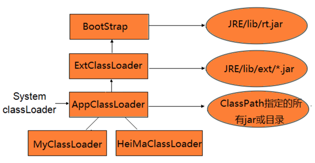

### JVM的类加载机制
---
#### 1、ClassLoader抽象类

类加载器的任务就是根据一个类的全限定名来读取此类的二进制字节流到JVM内部，然后转换为一个与目标类对应的java.lang.Class对象实例。

如果需要支持类的动态加载或需要对编译后的字节码文件进行解密操作等，就需要与类加载器打交道了。

   - BootstrapClassLoader，由C++编写嵌套在JVM内部，负责加载“JAVA_HOME/lib”目录中的所有类型，或者由“-Xbootclasspath”指定路径中的所有类型。
   - ExtClassLoader和AppClassLoader都继承至ClassLoader抽象类，由Java编写。
   - ExtClassLoader负责加载“JAVA_HOME/lib/ext”目录下的所有类型。
   - AppClassLoader负责加载ClassPath目录中的所有类型。
    
defineClass方法将字节码的byte数组转换为一个类的Class对象实例，如果希望在类被加载到JVM内部时就被链接，那么可以调用resolveClass方法。

#### 2、双亲委派模型
Parents Delegation Model，双亲委派模型，约定类加载器的加载机制。  



当一个类加载器接收到一个类加载的任务时，不会立即展开加载，而是将加载任务委派给它的超类加载器去执行，每一层的类都采用相同的方式，直至委派给最顶层的启动类加载器为止。如果超类加载器无法加载委派给它的类，便将类的加载任务退回给下一级类加载器去执行加载。

双亲委派模型的工作过程是：如果一个类加载器收到了类加载的请求，它首先不会自己去尝试加载这个类，而是把这个请求委派给父类加载器去完成，每一个层次的类加载器都是如此，因此所有的加载请求最终都应该传送到顶层的启动类加载器中，只有当父加载器反馈自己无法完成这个加载请求（它的搜索范围中没有找到所需的类）时，子加载器才会尝试自己去加载。

```
使用这种方式的好处是：能够有效确保一个类的全局唯一性，当程序中出现多个全限定名相同的类时，类加载器在执行加载时，始终只会加载其中的某一个类。
```
使用双亲委派模型来组织类加载器之间的关系，有一个显而易见的好处就是Java类随着它的类加载器一起具备了一种带有优先级的层次关系。例如类java.lang.Object，它存放在rt.jar之中，无论哪一个类加载器要加载这个类，最终都是委派给处于模型最顶端的启动类加载器进行加载，因此Object类在程序的各种类加载器环境中都是同一个类。相反，如果没有使用双亲委派模型，由各个类加载器自行去加载的话，如果用户自己编写了一个称为java.lang.Object的类，并放在程序的Class-Path中，那系统中将会出现多个不同的Object类，Java类型体系中最基础的行为也就无法保证，应用程序也将会变得一片混乱。如果自己去编写一个与rt.jar类库中已有类重名的Java类，将会发现可以正常编译，但永远无法被加载运行。

双亲委派模型对于保证Java程序的稳定运作很重要，但它的实现却非常简单，实现双亲委派的代码都集中在java.lang.ClassLoader的loadClass()方法之中，逻辑清晰易懂：先检查是否已经被加载过，若没有加载则调用父加载器的loadClass()方法，若父加载器为空则默认使用启动类加载器作为父加载器。如果父类加载失败，抛出ClassNotFoundException异常后，再调用自己的findClass()方法进行加载。

双亲委派机制只是Java虚拟机规范建议采用的加载机制，实际在tomcat中，类加载器所采用的加载机制与传统的双亲委派模型有一定的区别，当缺省的类加载器接收到一个类的加载任务时，首先会去由它自行加载，当它加载失败时，才会将类的加载任务委派给它的超类加载器去执行。

#### 3、自定义类加载器
程序中如果没有显式指定类加载器的话，默认是AppClassLoader来加载，它负责加载ClassPath目录中的所有类型，如果被加载的类型并没有在ClassPath目录中时，抛出java.lang.ClassNotFoundException异常。

一般是继承ClassLoader，如果要符合双亲委派规范，则重写findClass方法；要破坏的话，重写loadClass方法。

双亲委派模型的第一次“被破坏”其实发生在双亲委派模型出现之前——即JDK 1.2发布之前。由于双亲委派模型在JDK 1.2之后才被引入，而类加载器和抽象类java.lang.ClassLoader则在JDK1.0时代就已经存在，面对已经存在的用户自定义类加载器的实现代码，Java设计者引入双亲委派模型时不得不做出一些妥协。

为了向前兼容，JDK 1.2之后的java.lang.ClassLoader添加了一个新的protected方法findClass()，在此之前，用户去继承java.lang.ClassLoader的唯一目的就是为了重写loadClass()方法，因为虚拟机在进行类加载的时候会调用加载器的私有方法loadClassInternal()，而这个方法的唯一逻辑就是去调用自己的load-Class()。

上一节我们已经看过loadClass()方法的代码，双亲委派的具体逻辑就实现在这个方法之中，JDK1.2之后已不提倡用户再去覆盖loadClass()方法，而应当把自己的类加载逻辑写到findClass()方法中，在loadClass()方法的逻辑里如果父类加载失败，则会调用自己的findClass()方法来完成加载，这样就可以保证新写出来的类加载器是符合双亲委派规则的。

### 二、类加载过程
---


一个完整的类加载过程必须经历加载、连接、初始化这三个步骤：


##### 1、加载
简单的说，类加载阶段就是由类加载器负责根据一个类的全限定名来读取此类的二进制字节流到JVM内部，并存储在运行时内存区的方法区，然后将其转换为一个与目标类型对应的java.lang.Class对象实例（Java虚拟机规范并没有明确要求一定要存储在堆区中，只是hotspot选择将Class对象存储在方法区中），这个Class对象在日后就会作为方法区中该类的各种数据的访问入口。

##### 2、连接
连接阶段要做的是将加载到JVM中的二进制字节流的类数据信息合并到JVM的运行时状态中，经由验证、准备、解析三个阶段。

（1）验证阶段验证类数据信息是否符合JVM规范，是否是一个有效的字节码文件，验证内容涵盖了类数据信息的格式验证、语义分析、操作验证等


格式验证：验证是否符合class文件规范，比如以0xCAFEBABE开头，大小版本号等

语义验证：

* a、检查一个被标记为final的类型是否包含派生类
* b、检查一个类中的final方法是否被派生类进行重写
* c、确保超类与派生类之间没有不兼容的一些方法声明（比如方法签名相同，但方法的返回值不同）

操作验证：在操作数栈中的数据必须进行正确的操作，对常量池中的各种符号引用执行验证（通常在解析阶段执行，检查是否能通过符号引用中描述的全限定名定位到指定类型上，以及类成员信息的访问修饰符是否允许访问等）。

（2）准备阶段为类中的所有静态变量分配内存空间，并为其设置一个初始值（由于还没有产生对象，实例变量将不再此操作范围内）

（3）解析阶段将常量池中所有的符号引用转为直接引用（得到类或者字段、方法在内存中的指针或者偏移量，以便直接调用该方法）。这个阶段可以在初始化之后再执行。

##### 3、初始化
将一个类中所有被static关键字标识的代码统一执行一遍，如果执行的是静态变量，那么就会使用用户指定的值覆盖之前在准备阶段设置的初始值；如果执行的是static代码块，那么在初始化阶段，JVM就会执行static代码块中定义的所有操作。

所有类变量初始化语句和静态代码块都会在编译时被前端编译器放在收集器里头，存放到一个特殊的方法中，这个方法就是<clinit>方法，即类/接口初始化方法。该方法的作用就是初始化一个类中的变量，使用用户指定的值覆盖之前在准备阶段设定的初始值。任何invoke之类的字节码都无法调用<clinit>方法，因为该方法只能在类加载的过程中由JVM调用。

如果超类还没有被初始化，那么优先对超类初始化，但在<clinit>方法内部不会显示调用超类的<clinit>方法，由JVM负责保证一个类的<clinit>方法执行之前，它的超类<clinit>方法已经被执行。

JVM必须确保一个类在初始化的过程中，如果是多线程需要同时初始化它，仅仅只能允许其中一个线程对其执行初始化操作，其余线程必须等待，只有在活动线程执行完对类的初始化操作之后，才会通知正在等待的其他线程。

只有那些需要执行java代码来为类变量执行赋值操作的类型在编译之后才会在字节码中存在生成的<clinit>方法。如果一个类并没有声明任何的类变量，也没有静态代码块，那么这个类在编译为字节码后，字节码文件中将不会包含<clinit>方法；同样如果一个类声明类变量，但没有明确使用类变量的初始化语句以及静态代码块来执行初始化操作，编译后的字节码中也不会有<clinit>方法；只有final的静态变量也不会有该方法。

类初始化的6种时机:

1. 为一个类型创建一个新的对象实例时（比如new、反射、序列化）

2. 调用一个类型的静态方法时（即在字节码中执行invokestatic指令）

3. 调用一个类型或接口的静态字段，或者对这些静态字段执行赋值操作时（即在字节码中，执行getstatic或者putstatic指令），不过用final修饰的静态字段除外，它被初始化为一个编译时常量表达式

4. 调用JavaAPI中的反射方法时（比如调用java.lang.Class中的方法，或者java.lang.reflect包中其他类的方法）

5. 初始化一个类的派生类时（Java虚拟机规范明确要求初始化一个类时，它的超类必须提前完成初始化操作，接口例外）

6. JVM启动包含main方法的启动类时。

有几种特殊情况下：

1. 通过子类引用父类的静态字段，不会导致子类初始化
2. 通过数组定义来引用类，不会触发此类的初始化
3. 常量在编译阶段会存入调用类的常量池中，本质上并没有直接引用到定义常量的类，因此不会触发定义常量的类的初始化

数组本身并不是由类加载器负责创建，而是由JVM在运行时根据需要而直接创建的，但数组的元素类型仍然需要依靠类加载器去创建。
