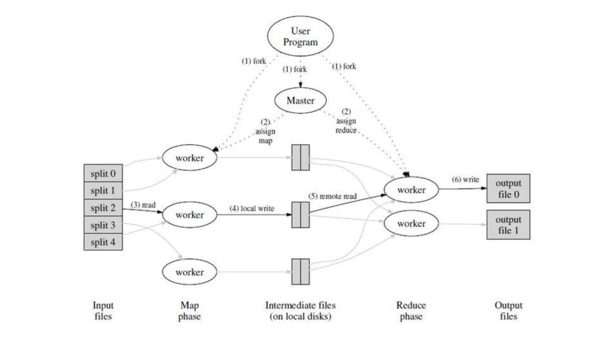

## Map-Reduce设计原理

### 概述
___
Map-Reduce 是一种编程模型，其目的是充分利用并行计算带来计算效率的提升，用户首先创建一 个 Map 函数处理一个基于 key/value pair 的数据集合,输出中间的基于 key/value pair 的数据集合;然后再创建 一个 Reduce 函数用来合并所有的具有相同中间 key 值的中间 value 值，系统运行时只关心: 如何分割输入数据,在大量计算机组成的集群上的调度,集群中计算机的错误处理,管理集群中计算机之间必要的通信。采用 MapReduce 架构可以使那些没有并行计算和分布式处理系统开发经验的程序员有效利用分布式系统的丰富资源。该模型的建立带来的问题有：如何处理并行计算、如何分发数据、如何处理错误、如何进行通信（IPC）?在计算机领域，一般的处理方案是分层模型，基于现有复杂的的内部模型，我们进一步的抽象出新的一层，屏蔽底层复杂的模型，暴露出简单的的接口，而不必关心并行计算、容错、数据分布、负载均衡等复杂的细节。

### 编程模型
___

MAP函数，REDUCE函数

### 实现
___

* 执行逻辑
mapreduce的执行图</img>
图 1 展示了我们的 MapReduce 实现中操作的全部流程。当用户调用 MapReduce 函数时,将发生下面的一 系列动作(下面的序号和图 1 中的序号一一对应)
	+ （1）用户程序首先调用的 MapReduce 库将输入文件分成 M 个数据片度,每个数据片段的大小一般从 16MB 到 64MB(可以通过可选的参数来控制每个数据片段的大小)。然后用户程序在机群中创建大量 的程序副本。
	+ （2）这些程序副本中的有一个特殊的程序–master。副本中其它的程序都是 worker 程序,由 master 分配 任务。有 M 个 Map 任务和 R 个 Reduce 任务将被分配,master 将一个 Map 任务或 Reduce 任务分配 给一个空闲的 worker。
	+ （3）被分配了 map 任务的 worker 程序读取相关的输入数据片段,从输入的数据片段中解析出 key/value pair,然后把 key/value pair 传递给用户自定义的 Map 函数,由 Map 函数生成并输出的中间 key/value pair,并缓存在内存中。
	+ （4）缓存中的 key/value pair 通过分区函数分成 R 个区域,之后周期性的写入到本地磁盘上。缓存的 key/value pair 在本地磁盘上的存储位置将被回传给 master,由 master 负责把这些存储位置再传送给 Reduce worke。
	+ （5）当 Reduce worker 程序接收到 master 程序发来的数据存储位置信息后,使用 RPC 从 Map worker 所在 主机的磁盘上读取这些缓存数据。当 Reduce worker 读取了所有的中间数据后,通过对 key 进行排序后使得具有相同 key 值的数据聚合在一起。由于许多不同的 key 值会映射到相同的Reduce任务上,因此必须进行排序。如果中间数据太大无法在内存中完成排序,那么就要在外部进行排。
	+ （6）Reduce worker 程序遍历排序后的中间数据,对于每一个唯一的中间 key 值,Reduce worker 程序将这 个 key 值和它相关的中间 value 值的集合传递给用户自定义的 Reduce 函数。Reduce 函数的输出被追加到所属分区的输出文。
	+ （6）当所有的 Map 和 Reduce 任务都完成之后,master 唤醒用户程序。在这个时候,在用户程序里的对MapReduce 调用才返回。
在成功完成任务之后,MapReduce 的输出存放在 R 个输出文件中(对应每个 Reduce 任务产生一个输出文件,文件名由用户指定)。一般情况下,用户不需要将这 R 个输出文件合并成一个文件–他们经常把这些文 件作为另外一个 MapReduce 的输入,或者在另外一个可以处理多个分割文件的分布式应用中用。

* 关于MASTER数据结构

Master 持有一些数据结构,它存储每一个 Map 和 Reduce 任务的状态(空闲、工作中或完成),以及 Worker 机器(非空闲任务的机器)的标识。Master 就像一个数据管道,中间文件存储区域的位置信息通过这个管道从 Map 传递到 Reduce。因此, 对于每个已经完成的 Map 任务,master 存储了 Map 任务产生的 R 个中间文件存储区域的大小和位置。当 Map 任务完成时,Master 接收到位置和大小的更新信息,这些信息被逐步递增的推送给那些正在工作的 Reduce 任 务。

案例研究：MapReduce

我们来谈谈MapReduce（MR）作为案例研究
  MR是6.824的主要主题的很好的例证
  并且是实验1的重点

MapReduce概述
  上下文：关于多TB数据集的多小时计算
    例如分析爬网网页的图形结构
    仅适用于1000台电脑
    经常不是由分布式系统专家开发的
    分配可能非常痛苦，例如应对失败
  总体目标：非专业程序员可以轻松拆分
    许多服务器的数据处理效率合理。
  程序员定义了Map和Reduce功能
    顺序代码; 往往相当简单
  MR在具有巨大输入的1000台机器上运行功能
    并隐藏分发细节
  
MapReduce的抽象视图
  输入分为M个文件
  输入1  - >地图 - > a，1 b，1 c，1
  输入2  - >地图 - > b，1
  输入3  - >地图 - > a，1 c，1
                    | | |
                        |  - >减少 - > c，2
                        ----->减少 - > b，2
  MR为每个输入文件调用Map（），生成一组k2，v2
    “中间”数据
    每个Map（）调用都是一个“任务”
  MR收集给定k2的所有中间版本v2，
    并将其传递给减号电话
  最终输出是从Reduce（）设置的<k2，v3>
    存储在R输出文件中

示例：字数
  输入是数千个文本文件
  地图（k，v）
    把v分成单词
    对于每个单词w
      发射（w，“1”）
  减少（k，v）
    发射（LEN（V））

MapReduce隐藏了许多痛苦的细节：
  在服务器上启动s / w
  跟踪哪些任务完成
  数据移动
  从故障中恢复

MapReduce缩放比例：
  N台计算机可以获得Nx吞吐量。
    假设M和R是> = N（即大量的输入文件和输出键）。
    Maps（）可以并行运行，因为它们不进行交互。
    与Reduce（）相同。
  所以你可以通过购买更多的电脑来获得更多的吞吐量
    而不是每个应用程序的特殊目的高效并行化。
    电脑比程序员便宜！

什么可能限制性能？
  我们关心，因为这是要优化的事情。
  中央处理器？记忆？磁盘？网络？
  2004年的作者受到“网络横截面带宽”的限制。
    [图：服务器，网络交换机树]
    注意所有数据都通过网络，在Map-> Reduce shuffle中。
    纸张根交换机：100到200吉比特/秒
    1800台机器，所以55兆位/秒/机。
    小，例如比磁盘或RAM速度要小得多。
  所以他们关心通过网络最小化数据的移动。
    （数据中心网络今天快得多）

更多细节（纸张图1）：
  主人：给工人任务; 记得中间产出的地方
  M Map任务，R减少任务
  存储在GFS中的输入，每个Map输入文件的3个副本
  所有电脑都运行GFS和MR工作人员
  比工人更多的输入任务
  主人给每个工作人员一个地图任务
    把老任务完成的新任务
  地图工作人员将中间密钥分为R个分区，在本地磁盘上
  no减少通话，直到所有地图完成
  master告诉Reducers从Map工作人员获取中间数据分区
  减少工作人员将最终输出写入GFS（每个Reduce任务一个文件）

详细设计如何减少网络慢的影响？
  地图输入从本地磁盘上的GFS副本读取，而不是通过网络读取。
  中间数据仅通过网络一次。
    地图工作人员写入本地磁盘，而不是GFS。
  中间数据被分割成包含许多键的文件。
    大网络传输效率更高。

他们如何获得良好的负载平衡？
  关键的缩放 -  N-1服务器等待1完成不好。
  但有些任务可能需要比其他任务更长的时间
  解决方案：比工作人员更多的任务。
    大师对完成以前任务的工作人员提出新的任务。
    所以没有任务是如此之大，它主导完成时间（希望）。
    所以服务器的工作速度要比较慢的服务器要慢一点，在同一时间内完成。

容错的呢？
  那么如果一个服务器在MR作业中崩溃了怎么办？
  隐藏失败是编程易用性的重要组成部分！
  为什么不从头开始重新开始整个工作？
  MR重新运行失败的Map（）和Reduce（）。
    MR要求他们是纯粹的功能：
      他们不会在电话中保持状态，
      它们不读取或写入除预期的MR输入/输出之外的文件，
      任务之间没有隐藏的沟通。
    所以重新执行产生相同的输出。
  对纯功能的要求是一个主要的限制
    MR与其他并行编程方案相比。
    但是MR的简单性至关重要。

工作人员崩溃恢复的细节：
  *地图工作人员崩溃：
    主人看到工作人员不再响应于ping
    崩溃的工作人员的中间地图输出丢失
      但是每个Reduce任务都可能需要它！
    主人重新运行，将任务扩展到其他GFS副本的输入。
    一些减员工可能已经读过失败的工作人员的中间数据。
      这里我们依赖于功能和确定性的Map（）！
    如果Reduces已经获取了所有中间数据，则master不需要重新运行Map
      尽管然后减少崩溃会强制重新执行失败的地图
  *减少工伤事故
    完成的任务可以 - 存储在GFS中，具有副本。
    大师重新开始工人对其他工人的未完成任务。
  *在编写输出时减少工作人员的崩溃。
    GFS具有原子重命名，防止在完成之前输出可见。
    所以主人可以安全地重新运行其他地方的Reduce任务。

其他故障/问题：
  *如果主人给两个工作人员同一张Map（）任务怎么办？
    也许主人错误地认为一个工人死了。
    它会告诉减少工人只有其中一个。
  *如果主人给两个工人同样的Reduce（）任务呢？
    他们都会尝试在GFS上编写相同的输出文件！
    原子GFS重命名防止混合; 一个完整的文件将可见。
  *如果单身工人很慢 - “分手”怎么办？
    也许是由于flakey硬件。
    主人开始了最后几个任务的第二个副本。
  *如果工作人员因h / w或s / w损坏而计算出错误的输出怎么办？
    太糟糕了！MR假设“故障停止”CPU和软件。
  *如果主机崩溃怎么办？

什么应用程序不适合MapReduce运行良好？
  不是一切适合地图/随机/减少模式。
  小数据，因为开销很高。例如不是网站的后端。
  对大数据的小更新，例如将一些文档添加到一个大的索引
  不可预测的读取（地图或缩小都可以选择输入）
  多次洗牌，例如页面级别（可以使用多个MR但不是非常有效）
  更灵活的系统允许这些，但更复杂的模型。

* 容错

	+ 当worker挂了

	+ 当master挂了
	   整个系统不再可用。
	+ 失效处理机制
        当一个任务在执行的过程中因为异常挂了，这个worker所执行的所有任务将失败，master会将其任务重新分配给其他的worker执行

* 存储位置

	+ 输入数据的存储位置，制定的方案是本地-就近方案，减少网络传输（带宽），另外网络传输也是需要耗时和不可靠的。

	+ 影响一个 MapReduce 的总执行时间最通常的因素是“落伍者”:在运算过程中,如果有一台机器花了很 长的时间才完成最后几个 Map 或 Reduce 任务,导致 MapReduce 操作总的执行时间超过预期。出现“落伍者” 的原因非常多。比如:如果一个机器的硬盘出了问题,在读取的时候要经常的进行读取纠错操作,导致读取Google MapReduce 中文版 1.0 版 数据的速度从 30M/s 降低到 1M/s我们有一个通用的机制来减少“落伍者”出现的情况。当一个 MapReduce 操作接近完成的时候,master调度备用(backup)任务进程来执行剩下的、处于处理中状态(in-progress)的任务。无论是最初的执行进程、 还是备用(backup)任务进程完成了任务,我们都把这个任务标记成为已经完成。我们调优了这个机制,通 常只会占用比正常操作多几个百分点的计算资源。我们发现采用这样的机制对于减少超大 MapReduce 操作的 总处理时间效果显著。

### 技巧
____

1. 分区函数
2. 顺序保证
3. Combiner 函数
4. 输入和输出的类型
5. 副作用
6. 跳过损坏的记录
7. 本地执行
    编写库可以满足在单机模拟分布式的任务调度。
8. 状态信息
    更具MASTER中做各个JOB和机器等的汇总统计信息。
9. 计数器
    在客户程序中自定义计数器，map做统计汇总。

### 性能
___

### 实践
___

Bulk Synchronous Programming和一些 MPI 原语提供了更高级别的并行处理抽象,可以更容易写 出并行处理的程序。MapReduce 和这些系统的关键不同之处在于,MapReduce 利用限制性编程模式实现了用 户程序的自动并发处理,并且提供了透明的容错处理。

我们数据本地优化策略的灵感来源于active disks等技术,在 active disks 中,计算任务是尽量推送 到数据存储的节点处理6,这样就减少了网络和 IO 子系统的吞吐量。我们在挂载几个硬盘的普通机器上执行我们的运算,而不是在磁盘处理器上执行我们的工作,但是达到的目的一样的。

我们的备用任务机制和 **Charlotte System**提出的**eager**调度机制比较类似。Eager 调度机制的一个缺点是 如果一个任务反复失效,那么整个计算就不能完成。我们通过忽略引起故障的记录的方式在某种程度上解决 了这个问题。

MapReduce 的实现依赖于一个内部的集群管理系统,这个集群管理系统负责在一个超大的、共享机器的 集群上分布和运行用户任务。虽然这个不是本论文的重点,但是有必要提一下,这个集群管理系统在理念上和其它系统,如 **Condor**是一样。

MapReduce 库的排序机制和**NOW-Sort**的操作上很类似。读取输入源的机器(map workers)把待排序 的数据进行分区后,发送到 R 个 Reduce worker 中的一个进行处理。每个 Reduce worker 在本地对数据进行排 序(尽可能在内存中排序)。当然,NOW-Sort 没有给用户自定义的 Map 和 Reduce 函数的机会,因此不具备 MapReduce 库广泛的实用性。
    
**River**提供了一个编程模型:处理进程通过分布式队列传送数据的方式进行互相通讯。和 MapReduce 类似,River 系统尝试在不对等的硬件环境下,或者在系统颠簸的情况下也能提供近似平均的性能。River 是 通过精心调度硬盘和网络的通讯来平衡任务的完成时间。MapReduce 库采用了其它的方法。通过对编程模型 进行限制,MapReduce 框架把问题分解成为大量的“小”任务。这些任务在可用的 worker 集群上动态的调度, 这样快速的 worker 就可以执行更多的任务。通过对编程模型进行限制,我们可用在工作接近完成的时候调度 备用任务,缩短在硬件配置不均衡的情况下缩小整个操作完成的时间(比如有的机器性能差、或者机器被某 些操作阻塞了)。
    
**BAD-FS**采用了和 MapReduce 完全不同的编程模式,它是面向广域网(alex 注:wide-area network)的。不过,这两个系统有两个基础功能很类似。
	
	1. 两个系统采用重新执行的方式来防止由于失效导致的数据丢失。
    2. 两个都使用数据本地化调度策略,减少网络通讯的数据量。

**TACC**是一个用于简化构造高可用性网络服务的系统。和 MapReduce 一样,它也依靠重新执行机制来实现的容错处理。
