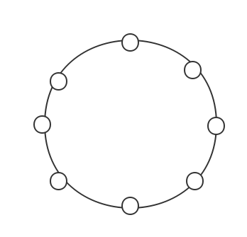

## 大型网站架构知识笔记
---
### 高性能
----

#### 性能评估指标

1. 响应时间
2. 并发数
3. 吞吐量
4. 性能计数器

性能测试方法：

**项目预热**

1. 性能测试
2. 负载测试
3. 压力测试
4. 稳定性测试

B+树和LSM树对的存储。

### 高可用
----

### 伸缩性
----
概述：对于网站的伸缩性，可从两方面入手，一方面是对已有功能的拆分，从而实现系统的物理分离，另一方面是在已有单个业务共能的基础上对其进行集群部署

#### 应用服务器伸缩性架构
概述：通过负载均衡服务器实现，根据不同的网络实现层次分为：应用层负载均衡（http重定向服务器，反向代理服务器），网络层负载均衡（IP形式，DNS域名解析服务器），数据链路层的负载均衡（根据修改动态的修改mac地址的形式）

#### 缓存伸缩性架构
概述：缓存的分布式伸缩性是通过集群部署缓存服务，但是由于缓存是具有不同的数据状态，所以不能简单的通过负载均衡来实现，可以使用分布式一致性hash算法来实现。



#### NOSQL和数据库的伸缩性方案
概述：数据库通过主从同步读写分离，对表进行分库分表，NoSQL通过实现框架的同步备份机制来实现伸缩性的数据一致性保证。

```

                        +--------------------------+
                        |                          |
                        |     DB-MOD ,TB-MOD       |
                        |                          |
                 +------+--------------------------+-----------+
                 |                                             |
                 |                                             |
+----------------v----------------+          +-----------------v-----------------+
|  +---------+     +---------+    |          |   +----------+      +----------+  |
|  | +-----+ |     | +-----+ |    |          |   | +------+ |      |  +-----+ |  |
|  | | TB  | |     | | TB  | |    |          |   | |  TB  | |      |  | TB  | |  |
|  | +-----+ |     | +-----+ |    |          |   | +------+ |      |  +-----+ |  |
|  |         |  DB |         |    |          |   |          |  DB  |          |  |
|  | +-----+ <-----> +-----+ |    |          |   | +------+ <------>  +-----+ |  |
|  | | TB  | |     | | TB  | |    |          |   | |  TB  | |      |  | TB  | |  |
|  | +-----+ |     | +-----+ |    |          |   | +------+ |      |  +-----+ |  |
|  |         |     |         |    |          |   |          |      |          |  |
|  |         |     |         |    |          |   |          |      |          |  |
|  +---------+     +---------+    |          |   +----------+      +----------+  |
|           DB cluster            |          |              DB cluster           |
+---------------------------------+          +-----------------------------------+

```

### 扩展性
---
概述：将系统服务化，系统通信方式可以有rpc,MQ,HTTP等方式，目的就是降低系统间的耦合，便于系统的后期扩展，服务化的过程中需要考虑服务降级进而对失效的转移，对系统的倾入性最小（便于系统的分散和聚合），异构系统的整合，负载均衡。

### 安全性
---
概述

#### 网站安全性问题与防御方式
概述

1. XSS攻击
2. SQL注入
3. CSRF攻击

#### 加密算法
概述

1. 单向散列加密算法

	- `MD5`算法:
	- `SHA`算法:
	
2. 对称加密算法

	- `RC`算法:
	- `DEC`算法:
	
3. 非对称加密算法

	- `RSA`算法:
	
``` 
RSA加密：非对称密钥，公开密钥算法RSA加密利用了单向函数正向求解很简单，反向求解很复杂的特性。
具体是利用了：
1.对两个质数相乘容易，而将其合数分解很难的这个特点进行的加密算法。 n=p1*p2，已知p1、p2求n简单，已知n求p1、p2困难。

2.(m^e) mod n=c，已知m、e、n求c简单，已知e、n、c求m很难。RSA加密，实现了公开密钥，就是A可以给所有人发送锁，其他人把要加密的信息用这把锁加密后发送给A，A用自己的钥匙开锁就可以获得加密的信息了。
反过来，A要发送加密信息给B，只要知道B的锁就可以了，而这个锁是公开的。

公开密钥n、e的生成：随机选取两个质数p1、p2，n=p1*p2，再随机选取一个整数e，e与φ(n)互质。

加密过程：(m^e) mod n=c，其中m为原信息，c为加密信息，n、e为公开密钥。

解密过程：(c^d) mod n=m，其中d为解密密钥。

解密密钥d的求解：(c^d) mod n=(((m^e) mod n)^d) mod n=((m^e)^d) mod n=(m^ed) mod n=m ①根据费马定理(m^φ(n)) mod n≡1，又1^k≡1，
所以(m^k*φ(n)) mod n≡1，两边同乘以m得m*((m^k*φ(n)) mod n)≡1*m，
化简(m^(k*φ(n)+1)) mod n≡m ②由①、②得ed=(k*φ(n)+1)，解得d=(k*φ(n)+1)/e。

费马定理：若p是素数，a与p互素，则a^(p-1）≡1 （mod p）
过程如下：

A：有一个公钥n、e。例如：3127、3。

B：有一个信息m。例如：89。

C：偷听者

A：第一步：随机找两个质数p1、p2，一个奇数e。例如：53、59、3。

第二步：计算n=p1*p2得到n，计算欧拉函数φ(n)=(p1-1)*(p2-1)得到φ(n)，计算钥匙d=(k*φ(n)+1)/e得到d。例如：53*59=3127、(53-1)*(59-1)=3016、(k*φ(n)+1)/e=(2*3016+1)/3=2011。

第三步：发送n、e给大家知道    //n、e就是公钥也做锁，d就是n、e的钥匙。C：获得n、e

B：第一步：获得n、e
第二步：加密信息m，(m^e) mod n=c，获得加密信息c。例如：(89^3) mod 3127=1394。
第三步：发送c给A

C：第一步：截获加密信息c
第二步：破解信息c，此时C只有n、e、c，只有把n分解质因数才能破解，而此分解很困难特别是当n很大的时候。

A：第一步：收到加密信息c第二步：解密信息c，(c^d) mod n=m，获得信息m。例如：(1394^2011) mod 3127=89。
```

#### 网站信息过滤与分组
概述

1. 文本匹配（Trie算法）
2. 分类算法（朴数贝叶斯算法和ARCS算法）